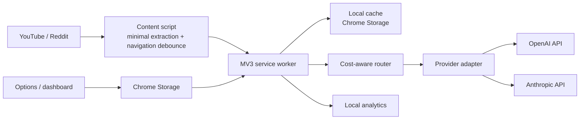

# IntelliBlock – AI-Powered Productivity Extension

IntelliBlock is a standalone Chrome Manifest V3 extension that makes productivity decisions using context rather than a static domain list. The v1 surface supports YouTube and Reddit: an educational YouTube lecture can be treated differently from entertainment on the same platform.

## Why this exists

Traditional blockers understand URLs, domains, or keywords. They cannot reliably distinguish a programming tutorial from a gaming video hosted on the same site, and they often force an all-or-nothing choice. IntelliBlock extracts a small metadata window, asks a configured LLM for a structured decision, caches safe repeats locally, and keeps the user in control with an explicit override.

## Features

- Productive / distracting / uncertain classification with confidence, category, and reason.
- OpenAI and Anthropic provider adapters behind one interface.
- Cost-aware cheap/strong model routing and token/cost telemetry when providers return usage.
- Exact and conservative near-duplicate local cache keyed by normalized content, provider/model, and relevant settings.
- YouTube SPA navigation handling and Reddit post extraction.
- Block, warn, or allow intervention modes plus independently configurable uncertain-content and provider-error fallback behavior.
- Local-only analytics: distribution, blocks, overrides, cache rate, latency, calls avoided, and recorded provider cost.
- Clear local data action, strict MV3 CSP, no eval, no project-owned backend, and bounded extraction.
- Separate evaluation dataset and real-provider evaluation command.

## Architecture



## Request and data flow

1. The content script identifies a supported video/post and extracts title, short description, author/community, canonical id, and bounded text.
2. It sends a typed message to the service worker. It does not send browsing history or page HTML.
3. The service worker loads settings, derives a cache key, and checks the local cache before any provider call.
4. A route chooses a cheaper model for rich straightforward context and the configured strong model for short, mixed, or low-context content.
5. The provider receives only the configured fields and returns validated JSON.
6. The service worker records local telemetry and returns the decision. The content script renders a reversible intervention when appropriate.

## AI classification and fallback

The classifier requires one of the user-configured providers. Missing credentials, timeouts, rate limits, invalid output, and provider errors never block the entire page by default: the configured fallback behavior (`allow`, `warn`, or `block`) is applied. Provider output is parsed and validated against a closed classification vocabulary before use.

## Semantic caching

The v1 cache uses normalized content plus SHA-256 fingerprints for exact reuse and a conservative 0.96 token-set similarity threshold for near-duplicate reuse. Entries include provider, selected model, relevant productivity settings, result, creation time, and expiry. This is intentionally conservative: it avoids unsafe reuse across changed goals or settings. Embedding-backed retrieval can be added behind the same cache interface in a later version without sending data to a project server.

## Cost-aware routing

Cache hit: no model call. Rich, unambiguous metadata: configured cheap model. Short, mixed, or low-context metadata: configured strong model. Usage is read from OpenAI/Anthropic responses when available; the dashboard reports a configured approximation only when token counts exist. Pricing is not silently presented as universal—update the provider adapter if pricing changes.

## Privacy and security model

- No IntelliBlock-owned backend exists. The extension calls the selected provider directly.
- Page extraction is bounded and limited to necessary metadata/content; descriptions are optional.
- Analytics and cache stay in `chrome.storage.local` by default and can be cleared from Options.
- API keys are not hard-coded and are stored in local Chrome extension storage. This is not a fully secure secret vault: a user with access to the browser profile, debugging tools, or a compromised local environment may retrieve the key. Browser extensions also cannot make a client-side key invisible to the browser/runtime. For higher assurance, a user-controlled proxy with its own threat model would be required; that is deliberately not included here.
- Permissions are limited to `storage`, the two supported platforms, and the two provider API origins.
- MV3 extension pages use a strict self-only CSP. There is no `eval()`, remote script, or dynamic code execution.
- LLM strings are inserted with `textContent`, not HTML, and messages are type-discriminated.

## Setup

```bash
cd IntelliBlock
npm install
npm run dev          # local Vite development server for UI work
npm run typecheck
npm test
npm run build       # production extension bundle in dist/
```

The extension itself does not require a project `.env` file. Open IntelliBlock Options after installation and enter a provider/model/API key. The optional `.env.example` is only for the real-provider evaluation script.

## Install in Chrome

1. Run `npm run build`.
2. Open `chrome://extensions`.
3. Enable Developer mode.
4. Choose **Load unpacked** and select `IntelliBlock/dist`.
5. Open the extension Options page, choose a provider, and save settings.
6. Visit a YouTube video or Reddit post. The first decision may take a few seconds; later matching content can be served from local cache.

## Testing and evaluation

`npm test` covers parser validation, cache hit/expiry, routing, settings normalization, fallback-oriented safety, platform navigation guards, analytics calculations, metrics, and a classifier/cache integration flow.

The repository includes 12 labeled examples in `src/evaluation/dataset.ts`, kept separate from production events. Run a real-provider evaluation only when you intentionally want to incur provider usage:

```bash
cp .env.example .env
# set EVAL_API_KEY and optionally EVAL_PROVIDER/EVAL_MODEL
npm run evaluate
```

The command prints accuracy, per-class precision/recall/F1, and a confusion matrix from that run. No evaluation results are claimed here because no real-provider experiment was run during repository generation. The dataset is small and illustrative, not a scientific benchmark.

## Limitations and future improvements

The extension cannot make a client-side API key fully confidential. Provider availability and model output quality are external dependencies. The cache's near-duplicate strategy is conservative token overlap, not an embedding service. Reddit and YouTube markup can change, so extraction selectors need maintenance. V1 does not claim productivity improvement, intent, or time saved. Future work could add optional user-controlled proxy support, embedding-backed cache reuse, more platforms, opt-in aggregate evaluation, richer settings import/export, and browser-level focus schedules.

## Project layout

```text
src/
  background.ts          MV3 service worker and message flow
  content.ts            debounced extraction, navigation, intervention UI
  classifier/            parser, router, orchestration
  providers/             OpenAI and Anthropic adapters
  cache/                 normalized fingerprint and TTL cache
  analytics/             local event recording and derived metrics
  platforms/             YouTube and Reddit extraction/navigation
  options/               settings UI
  dashboard/             local analytics UI
  evaluation/            labeled dataset, metrics, real-provider runner
tests/                    unit and integration-style tests
```
